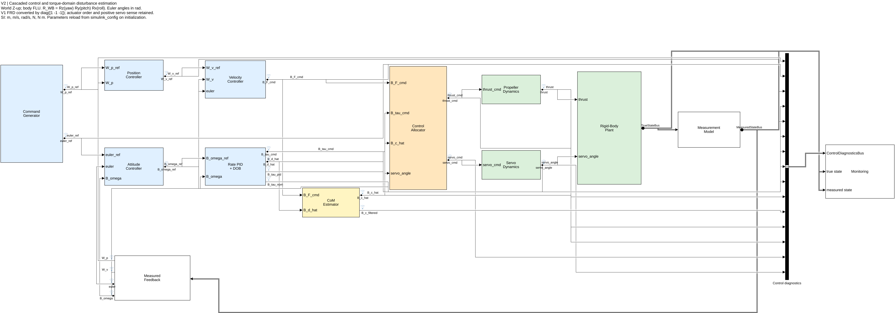

# V2 research model

Open `src/V2.slx` in MATLAB/Simulink R2024b. V1 remains a reference and is not
edited by the builder. V2 exposes the control equations in native block diagrams.



```matlab
addpath('src/simulink_config');
build_v2;                     % regenerate and compile src/V2.slx
report = test_v2;              % structural and numerical simulation checks
open_system('src/V2.slx');
out = sim('V2');
out.logsout.get('B_d_hat').Values
export_v2_diagram;             % native diagram previews
inspect_v2_scopes;             % actual Scope datasets and hover waveform previews
```

## Visible control architecture

The upper lane is Position Controller → Velocity Controller → body force. The
lower lane is Attitude Controller → Rate Controller + DOB → body torque. The
raw CoM estimate feeds the allocator, followed by separate propeller/servo
actuators and the rigid-body plant. Measured states return on one bottom bus.
Diagnostic buses feed Monitoring, which has no outputs.

`v2_build_controls.m` authors the research-critical blocks. Each controller has
an explicit error calculation and a PID subsystem containing three **native
Discrete PID Controller blocks**, named X/Y/Z PID or Roll/Pitch/Yaw PID. Their
P/I/D fields reference `CTRL.position.*`, `CTRL.velocity.*`, `CTRL.attitude.*`,
or `CTRL.rate.*`; gains are not copied into masks as numeric literals.

The native PID blocks use parallel form, backward-Euler integration, clamping
anti-windup, independent integral-contribution limits, and output limits.
External `ydot` inputs preserve derivative-on-measurement damping. Position,
velocity, and rate controllers obtain this input from explicit sampled
differences; attitude uses measured body rate directly. The measurement-rate low-pass is an explicit
subsystem with `alpha = 1-exp(-2*pi*derivative_cutoff_hz*Ts)`. The native
PID's internal D filter is off, so its D gain acts on that filtered rate.
This conversion adopts native Simulink clamping semantics; it is
not a promise of bit-for-bit equivalence with the previous candidate-integral
C++/MATLAB implementation at saturation transitions.

Position velocity feed-forward uses a visible sampled difference, exponential
filter, and enable Switch. It defaults off. It is added after the native PID
output and the combined velocity demand is bounded again. Velocity control
adds nominal gravity, multiplies by nominal mass, enforces nonnegative world-Z
force, rotates into body coordinates, and applies force limits. There is no
acceleration trajectory feed-forward. Attitude error remains a small helper
using the shortest SO(3) rotation vector of `R_WB' * R_ref`; PID state and
integration are not inside this helper.

## Conventional torque DOB

Open `Rate Controller + DOB/Conventional DOB` to inspect the inverse nominal
plant and Butterworth filters:

```
Q(s) = wc² / (s² + sqrt(2)*wc*s + wc²)
B_tau_gyro = cross(B_omega, J_nominal*B_omega)
B_tau_nom = B_tau_pid + (gyroscopic_ff.enable ? B_tau_gyro : 0)
B_tau_effective = B_tau_cmd - B_tau_gyro
B_d_raw = J_nominal*sQ(s)*B_omega - Q(s)*B_tau_effective
B_d_hat = dob.enable ? bound(sample(B_d_raw), dob.estimate_limit) : 0
B_tau_cmd = bound(B_tau_nom - (dob.compensate ? B_d_hat : 0), torque_limit)
```

Here `wc = CTRL.dob.cutoff_rad_s`. Positive disturbance is additive plant
torque: `J*omega_dot = B_tau_cmd - cross(omega,J*omega) + d`. The modeled gyro
term is removed from the observer input regardless of the gyro feed-forward
switch. The observer sees the **final saturated commanded torque**, not a
prediction based on the previous estimate or the measured actuator torque.
Actuator mismatch therefore remains part of the observed disturbance.

Each Q/sQ subsystem contains three explicit continuous State-Space blocks,
with `A=[-sqrt(2)*wc -wc²;1 0]`, `B=[1;0]`, `D=0`. For Q, `C=[0 wc²]`;
for sQ, `C=[wc² 0]`. Both paths are strictly proper and break the feedback
loop without an unfiltered ideal derivative. The sQ states initialize at the
configured measured-rate equilibrium to avoid a startup impulse at nonzero
initial rate. Estimates are sampled at `CTRL.sample_time` for compensation.
This replaces the previous sampled predictor with a conventional continuous
filter realization; it is an intentional observer discretization change.

| enable | compensate | Published estimate | Torque command |
|---|---|---|---|
| false | either | zero | bounded nominal torque |
| true | false | normal estimate, delivered to MOCE | bounded nominal torque |
| true | true | normal estimate, delivered to MOCE | bounded nominal minus estimate |

Explicit Switch blocks implement both controls. Filter states may evolve when
publication is disabled; parameter overrides are applied on initialization.

## Visible MOCE

Open `CoM Estimator` to follow:

```
B_F_cmd → Force Q(s) → skew(QF) → J_nominal inverse → Transpose
        → matrix product with B_d_hat → Gamma → rate limits
        → force/axis gates → enable Switch → projected CoM integrator → B_c_hat
```

The adaptation law is `c_dot = gamma .* ((J_nominal \ skew(QF))' * B_d_hat)`.
Force filtering uses explicit Butterworth State-Space blocks, independently
configured by `CTRL.moce.force_cutoff_rad_s`. Small helpers construct `skew`
and apply force/excitation gates. A native limited Discrete-Time Integrator
uses forward Euler at the controller rate, with the configured initial CoM
and component-wise offset limits. Disabled adaptation holds that initial CoM.
Z adaptation defaults off. `B_c_hat` goes directly to allocation;
`B_c_filtered` passes through a separate visible smoothing filter for
monitoring only. DOB estimation can drive adaptation without compensation.

## Scopes and logging

All nine named Scopes live in `Monitoring` and show legends:

| Scope | Signals |
|---|---|
| Position Tracking | W_p_ref, W_p |
| Velocity Tracking | W_v_ref, W_v |
| Attitude Tracking | euler_ref, euler |
| Rate Tracking | B_omega_ref, B_omega |
| Body Force | B_F_cmd, B_F_actual |
| Torque and DOB | B_tau_pid, B_tau_nom, B_d_hat, B_tau_cmd, B_tau_actual |
| CoM Estimation | B_c_hat, B_c_true, B_c_filtered |
| Propeller Commands | thrust_cmd, thrust |
| Servo Commands | servo_cmd, servo_angle |

Scopes are sinks only and do not open automatically during batch runs.
`B_c_true` is a Constant referencing `PLANT.derived.com(:)`. All listed
signals also remain logged in `logsout`; `B_tau_effective` and the estimate
entering MOCE are logged for equation/routing checks. Units are SI: metres,
metres/second, radians, radians/second, newtons, and newton-metres. Propeller
commands are thrust in newtons, not motor speed. Servo signals are radians.

## Parameters, frames, and plant

| File | Responsibility |
|---|---|
| CTRL.m | PID gains, limits, timing, nominal physics, allocator, DOB, MOCE |
| PLANT.m | True vehicle, rotor geometry, propellers, servos, gravity |
| SENSOR.m | Sensor noise, bias, and common measurement delay |
| EXP.m | Trajectories, payload, initial state, seed, duration/physics step |
| init_v2.m | Fresh parameters, explicit overrides, derived total mass/CoM/inertia |

Model open and simulation initialization reload parameters into the **model
workspace**. Base-workspace variables do not silently override them. Edit the
parameter files or supply explicit model-workspace overrides:

```matlab
load_system('src/V2.slx');
w = get_param('V2','ModelWorkspace');
overrides.CTRL.dob.enable = true;
overrides.CTRL.dob.compensate = false;
overrides.CTRL.moce.enable = true;
assignin(w,'V2_OVERRIDES',overrides);
out = sim('V2');
assignin(w,'V2_OVERRIDES',struct());
```

The current defaults follow the editable MuJoCo-aligned parameter files,
including base/rotor inertia aggregation and a point payload. They are not
frozen to historical V1 mass/geometry values. World Z is up and body axes are
FLU. `R_WB=Rz(yaw)*Ry(pitch)*Rx(roll)` maps body to world. Euler kinematics
remain singular at pitch ±pi/2; the attitude-error helper uses SO(3).

Newton's equation integrates the combined CoM position/velocity. The existing
`v2_body_origin` helper converts these into fixed body-origin feedback, matching
`EXP.initial.position/velocity`. Initialization uses the derived CoM offset
and initial angular velocity consistently. Combined inertia uses the
parallel-axis theorem about the resulting CoM, independently of nominal
controller inertia.

The existing motor-effectiveness helper applies bounded drift and individual
rotor scale **before delay and motor lag**, matching its configured ordering.
Servo travel is bounded before and after delay/lag/DC gain. The allocation
logic, plant wrench equations, and actuator ordering otherwise remain in their
small existing kernels. Nominal and true reaction torque parameters remain
independent. This free-flight model has no ground contact or arming state.

## Validation and regeneration

`test_v2` verifies twelve native axis PID blocks and their parameter references,
independent small-signal P/I/D equations for all four PID banks, nine explicit
Q/sQ state-space blocks, the MOCE integrator, all Scope ports,
logging widths/finite values, and absence of hidden controller-kernel calls.
It compiles with algebraic loops configured as errors, runs the default 10 s
hover, toggles controller modes, exercises all DOB enable/compensate pairs with
MOCE enabled, and checks compensation equations, estimate routing, nonzero
adaptation, limits, payload excitation, and repeatable noise. `validation.txt`
records executed results. The gravity-disabled short case checks numerical
validity rather than stable hover.

`inspect_v2_scopes` captures the actual nine Scope datasets during default hover
and checks their signal counts and finite values. It restores Scope logging
settings afterward. Review [all Scope waveforms](V2_scope_diagnostics.png),
[torque/DOB by axis](V2_scope_torque_dob.png), [native PID blocks](V2_pid.png),
[the DOB diagram](V2_dob.png), and [the MOCE diagram](V2_moce.png).

`build_v2.m`, `v2_build_controls.m`, and `v2_build_monitoring.m` are authoritative
model sources. Rebuild after changing these or embedded helper code. Parameter
changes do not require rebuilding. Legacy controller kernels are retained as
reference code; V2 does not execute `v2_position`, `v2_velocity`, `v2_attitude`,
`v2_rate_dob`, `v2_moce`, `v2_pid`, or `v2_q` in its critical control paths.
